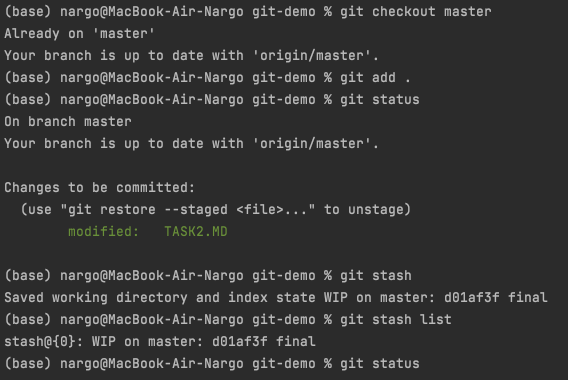

1) `git diff`
2) `git status`
3) `git add . && git commit -am "some changes"`
4) `git status`
5) `git push -u origin master`

Конфликная ситуация:

Конфликт решила путем применения команды `git reset`, откатилась до последнего коммита и исправила разницу в файлах вручную, посмотрев на изменения через команду `git diff`.
далее `git merge develop` и `git push`

PS Я буду делать задание 3
